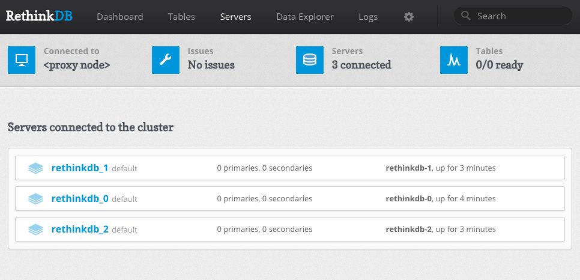

Rethinkdb StatefulSet
=====================

This directory contains a [StatefulSet](https://kubernetes.io/docs/concepts/abstractions/controllers/statefulsets/). 
Note: StatefulSets are a beta feature in 1.5

GKE Instructions
================
// TODO

AWS Instructions
================

```bash
# The helper script will create the volume and generate the 
# rethinkdb-aws-pv.yml file
╰─$ AWS_REGION=us-west-1 AWS_ZONE=us-west-1a VOL_SIZE=5 ./rethinkdb-aws-pv.sh
EBS Volume ID: vol-0f88c0bfa22XXXXXX

# Create a PersistentVolume.
╰─$ kubectl create -f rethinkdb-aws-pv.yml 
persistentvolume "rethinkdb" created

# Start the service. 
╰─$ kubectl create -f rethinkdb-service.yml 
service "rethinkdb" created

# Create the StatefulSet
╰─$ kubectl create -f rethinkdb-statefulset.yml 
statefulset "rethinkdb" created

# Start up an admin server and service.
╰─$ kubectl create -f rethinkdb-admin.yml 
service "rethinkdb-admin" created
deployment "rethinkdb-admin" created

# Poke around to verify...
╰─$ kubectl get pv
NAME                                       CAPACITY   ACCESSMODES   RECLAIMPOLICY   STATUS      CLAIM                      REASON    AGE
pvc-15bf9c39-dea6-11e6-ac2e-02b95063087e   10Gi       RWO           Delete          Bound       default/data-rethinkdb-0             13m
pvc-15c7494c-dea6-11e6-ac2e-02b95063087e   10Gi       RWO           Delete          Bound       default/data-rethinkdb-1             13m
pvc-15cbe662-dea6-11e6-ac2e-02b95063087e   10Gi       RWO           Delete          Bound       default/data-rethinkdb-2             13m
rethinkdb                                  5Gi        RWO           Retain          Available                                        18m

╰─$ kubectl get statefulset,po,svc
NAME                     DESIRED   CURRENT   AGE
statefulsets/rethinkdb   3         3         15m

NAME                                  READY     STATUS    RESTARTS   AGE
po/rethinkdb-0                        1/1       Running   0          15m
po/rethinkdb-1                        1/1       Running   0          14m
po/rethinkdb-2                        1/1       Running   0          13m
po/rethinkdb-admin-1722877930-m4sfc   1/1       Running   0          13m

NAME                  CLUSTER-IP    EXTERNAL-IP        PORT(S)          AGE
svc/rethinkdb         None          <none>             29015/TCP        18m
svc/rethinkdb-admin   10.0.10.155   a40e03795dea6...   8080:31430/TCP   13m

```

Warning! 
The admin service is type LoadBalancer so it will create an ELB for you. The admin service is NOT secured.

Find the ELB in the AWS console and visit port :8080. You should see three servers in the servers tab.


